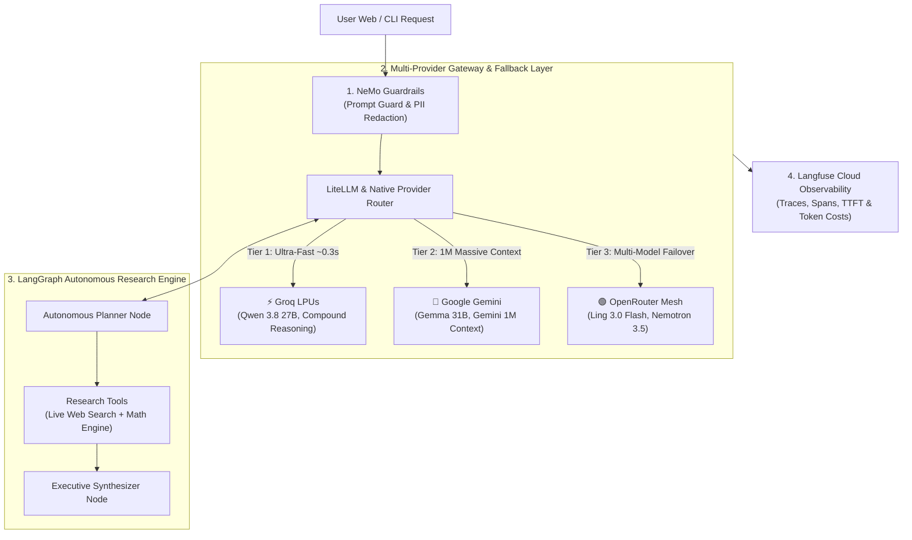

# Framework-maxxing: Enterprise Multi-Model AI Gateway & Autonomous Research Agent

[](https://www.python.org/downloads/)
[](https://fastapi.tiangolo.com)
[](https://cloud.langfuse.com)
[](https://github.com/NVIDIA/NeMo-Guardrails)
[](https://groq.com)
[](LICENSE)

An enterprise-grade, high-throughput AI architecture combining **Multi-Provider Dynamic Routing** (Groq LPUs, Google Gemini, OpenRouter), **NeMo Guardrails Policy Engine**, **LangGraph Stateful Autonomous Agents**, and **Langfuse Cloud Observability**.

---

## 🌟 Key Architectural Pillars



1. **⚡ Multi-Cloud Inference Mesh**: Zero vendor lock-in. Dynamically routes requests across Groq LPUs (sub-second token generation), Google Gemini (1M token context), and OpenRouter with automatic failover.
2. **🛡️ NeMo Guardrails Safety Layer**: Intercepts jailbreaks, adversarial prompt injections, and off-topic requests in **<1ms** before any LLM tokens are consumed; redacts sensitive PII on inputs and outputs.
3. **🧠 LangGraph Research Agent**: Multi-node stateful graph (`Guardrail` $\rightarrow$ `Planner` $\rightarrow$ `Executor` $\rightarrow$ `Synthesizer`) with tool calling (DuckDuckGo Live Search + Math Engine).
4. **📈 Langfuse Cloud Observability**: End-to-end tracing, nested spans, latency tracking (TTFT), token counts, and cost calculation synced to [cloud.langfuse.com](https://cloud.langfuse.com).
5. **🎨 Modern ChatGPT Web Interface**: Dark-themed ChatGPT clone built with FastAPI + Vanilla JS, Server-Sent Events (SSE) streaming, and **Two-Way Voice Mode** (Groq Whisper Turbo STT + Browser TTS).

---

## 📂 Refactored Project Structure

```
Framework-maxxing/
├── config/                          # Centralized configuration & policies
│   ├── nemoguardrails/              # NeMo Guardrails Colang files & safety policies
│   └── litellm_config.yaml          # LiteLLM proxy & model alias routes
│
├── src/                             # Core Application Framework
│   ├── common/                      # Centralized Pydantic Settings & colored logger
│   │   ├── config.py
│   │   └── logging.py
│   │
│   ├── gateway/                     # Multi-Provider Routing & Gateway (Groq, Gemini, OpenRouter)
│   │   └── router.py
│   │
│   ├── guardrails/                  # NeMo Guardrails safety & PII redaction
│   │   └── rails_manager.py
│   │
│   ├── agent/                       # LangGraph Autonomous Research Agent
│   │   ├── state.py                 # Graph state schema
│   │   ├── tools.py                 # DuckDuckGo search & calculator
│   │   └── graph.py                 # Compiled StateGraph workflow
│   │
│   ├── observability/               # Langfuse Cloud Tracer & span manager
│   │   └── tracer.py
│   │
│   └── server/                      # FastAPI Backend & SSE Streaming API
│       ├── app.py                   # FastAPI application factory
│       └── models.py                # Request/response schemas
│
├── static/                          # ChatGPT Look-Alike Web UI Assets
│   ├── index.html                   # Modern Tailwind + Marked.js UI
│   ├── style.css                    # Custom animations & styling
│   └── app.js                       # Client-side streaming & voice handlers
│
├── examples/                        # Standalone Demos & Benchmark Scripts
│   ├── 01_all_in_one_pipeline.py    # Self-contained end-to-end pipeline
│   ├── 02_groq_speed_benchmark.py   # Groq LPU latency & token speed benchmark
│   ├── 03_gateway_caching_demo.py   # LiteLLM 0ms caching & failover demo
│   └── 04_multi_provider_demo.py    # Cross-provider collaborative task demo
│
├── tests/                           # 13 Passing Pytest Unit & Integration Tests
├── main.py                          # Unified CLI Entrypoint
├── pyproject.toml                   # Python dependencies & build config
└── README.md
```

---

## 🚀 Quickstart Guide

### 1. Activate Virtual Environment
```powershell
.venv\Scripts\activate
```

### 2. Configure Credentials (`.env`)
Create your `.env` file with your API keys:
```ini
# Multi-Provider Keys
OPENROUTER_API_KEY=your_openrouter_api_key_here
GEMINI_API_KEY=your_gemini_api_key_here
GROQ_API_KEY=your_groq_api_key_here

# Default Models
PRIMARY_MODEL=groq/qwen/qwen3.8-27b
FALLBACK_MODEL=openrouter/inclusionai/ling-3.0-flash-fin:free

# Langfuse Observability
LANGFUSE_PUBLIC_KEY=pk-lf-your_public_key
LANGFUSE_SECRET_KEY=sk-lf-your_secret_key
LANGFUSE_HOST=https://cloud.langfuse.com
LANGFUSE_ENABLED=true
```

---

## 💻 Running the Application

### 1. Launch the ChatGPT Web UI & Voice Mode *(FastAPI + JavaScript)*
```powershell
.venv\Scripts\python.exe main.py server
```
> 👉 *Open in your browser at: **`http://localhost:8080`***
> *Features: Token-by-token streaming, Voice Input (Groq Whisper Turbo), Auto-Speak (TTS), and live terminal logs on every request.*

---

### 2. Run LangGraph Autonomous Research Agent
```powershell
.venv\Scripts\python.exe main.py agent "Evaluate multi-cloud LLM gateway latency and caching"
```

---

### 3. 📣 Run Autonomous Agentic Marketing Campaign Workflow
Generate multi-channel campaigns (Twitter/X, LinkedIn, Email Nurture) with market research, brand voice enforcement, and self-correction critique loops:
```powershell
.venv\Scripts\python.exe main.py marketing "AI Gateway that reduces LLM inference costs by 70% with 0ms caching"
```

---

### 4. Run Multi-Provider Speed & Latency Benchmark
```powershell
.venv\Scripts\python.exe main.py benchmark
```

---

### 5. 📊 Run Enterprise Evaluation & Benchmarking Suite (RAG Triad, Safety, Marketing, Tools)
Run the automated evaluation benchmark across **NeMo Guardrails security, Agent tool accuracy, Marketing campaign compliance, RAG Faithfulness (LLM Judge), and Multi-Provider latency**:
```powershell
.venv\Scripts\python.exe main.py eval
```
> 👉 *Exports a complete markdown scorecard to `evaluation_report.md` and syncs evaluation traces to [Langfuse Cloud](https://cloud.langfuse.com).*

---

## 🧪 Running the Examples & Test Suite

### Standalone Examples:
```powershell
# Example 1: End-to-end pipeline demo
.venv\Scripts\python.exe examples/01_all_in_one_pipeline.py

# Example 2: Groq LPU speed test
.venv\Scripts\python.exe examples/02_groq_speed_benchmark.py

# Example 3: LiteLLM 0ms caching and failover demo
.venv\Scripts\python.exe examples/03_gateway_caching_demo.py

# Example 4: Multi-provider collaborative task
.venv\Scripts\python.exe examples/04_multi_provider_demo.py

# Example 5: Enterprise AI Evaluation & Benchmarking Suite
.venv\Scripts\python.exe examples/05_evaluation_benchmark.py

# Example 6: Autonomous Agentic Marketing Campaign Generator
.venv\Scripts\python.exe examples/06_marketing_agent_workflow.py
```

### Automated Pytest Suite (21 Tests):
```powershell
.venv\Scripts\pytest.exe -v
```

---

## 📜 License
MIT License. Free for commercial and open-source usage.
