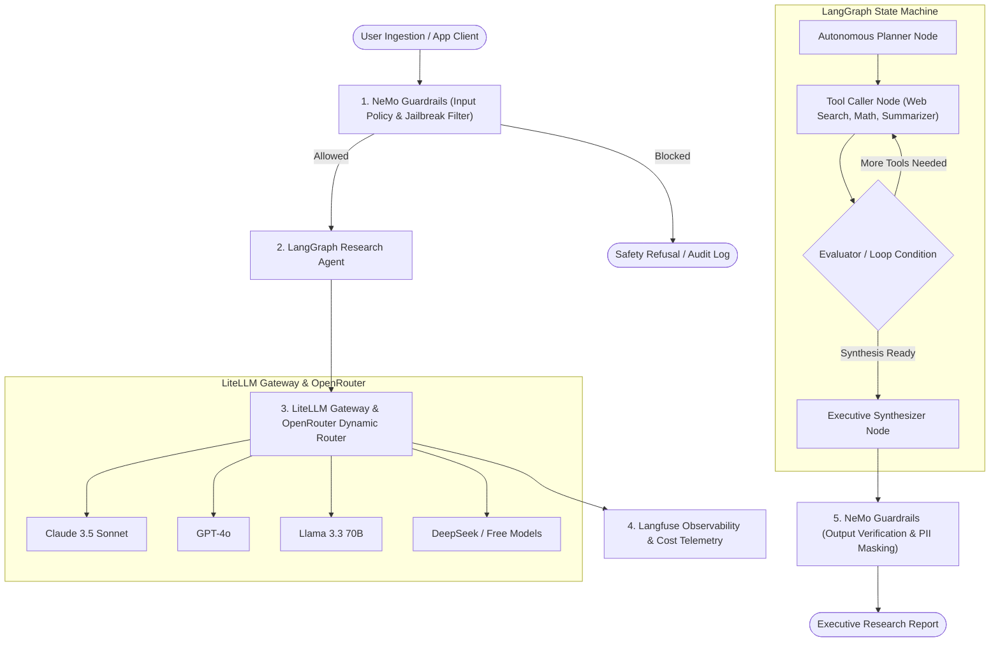

# AIPoc: Enterprise AI Architecture POC Suite

A modular, production-ready Proof of Concept suite showcasing an integrated multi-tier LLM architecture:



---

## 🌟 Key Architectural Components

| Component | Description | Primary Location |
| :--- | :--- | :--- |
| **OpenRouter Routing** | Dynamic multi-model routing across top foundation models with automatic fallback. | `src/gateway/router.py` |
| **LiteLLM Gateway** | Unified OpenAI-compatible proxy gateway, load balancing, rate limiting, and callbacks. | `config/litellm_config.yaml`, `src/gateway/` |
| **Langfuse Observability** | Traces LLM calls, latency, tokens, session IDs, spans, and estimated costs. | `src/observability/` |
| **NeMo Guardrails** | Multi-layered defense: jailbreak checks, prompt injection mitigation, topic boundaries, PII masking. | `config/nemoguardrails/`, `src/guardrails/` |
| **LangGraph Agent** | Stateful cycle graph with Planner node, dynamic Tool Caller node, and Synthesizer node. | `src/agent/` |
| **Unified Pipeline** | End-to-end orchestrator connecting all 5 subsystems with Rich terminal visualization. | `src/pipeline/runner.py` |

---

## 🖥️ Interactive Streamlit Web Interface

Launch the full-featured visual dashboard to interact with all POCs, test prompt safety, view research plans, and monitor live Langfuse telemetry:

```powershell
.venv\Scripts\streamlit.exe run app.py
```
Open your browser at `http://localhost:8501`.

---

## 🚀 Quickstart Guide

### 1. Environment Setup
Always activate your Python virtual environment:
```powershell
# In Windows PowerShell:
.venv\Scripts\activate
```

### 2. Configuration (`.env`)
The `.env` file should be configured with your API credentials:
```ini
OPENROUTER_API_KEY=your_openrouter_api_key_here
GEMINI_API_KEY=your_gemini_api_key_here
OPENROUTER_BASE_URL=https://openrouter.ai/api/v1
LITELLM_PROXY_HOST=127.0.0.1
LITELLM_PROXY_PORT=4000
LITELLM_MASTER_KEY=sk-litellm-master-key-poc

# Default Models
PRIMARY_MODEL=gemini/gemma-4-31b-it
FALLBACK_MODEL=openrouter/inclusionai/ling-3.0-flash-fin:free
PLANNER_MODEL=gemini/gemma-4-31b-it
SYNTHESIS_MODEL=openrouter/inclusionai/ling-3.0-flash-fin:free

# Langfuse Observability
LANGFUSE_PUBLIC_KEY=pk-lf-your_public_key_here
LANGFUSE_SECRET_KEY=sk-lf-your_secret_key_here
LANGFUSE_HOST=https://cloud.langfuse.com
LANGFUSE_BASE_URL=https://cloud.langfuse.com
LANGFUSE_ENABLED=true
```

---

## 🧪 Running the Proof of Concept (POC) Scripts

### POC 1: OpenRouter Routing & LiteLLM Gateway
Demonstrates multi-model aliases, latency-based routing, and fallback chains.
```powershell
.venv\Scripts\python.exe pocs/01_litellm_openrouter_poc.py
```

### POC 2: Langfuse Observability & Span Hierarchy
Demonstrates session tracing, span nesting, token metrics, and cost calculation.
```powershell
.venv\Scripts\python.exe pocs/02_langfuse_tracing_poc.py
```

### POC 3: NeMo Guardrails Input/Output Enforcement
Demonstrates blocking jailbreaks, adversarial attacks, off-topic requests, and PII masking.
```powershell
.venv\Scripts\python.exe pocs/03_nemo_guardrails_poc.py
```

### POC 4: LangGraph Research Planner & Tool Caller
Demonstrates autonomous query decomposition, tool calling (Search, Math, Summaries), and synthesis.
```powershell
.venv\Scripts\python.exe pocs/04_langgraph_research_agent_poc.py
```

### POC 5: Unified End-to-End Pipeline
Executes the full pipeline demonstrating legitimate complex research queries vs. intercepted attacks.
```powershell
.venv\Scripts\python.exe pocs/05_unified_end_to_end_poc.py
```

---

## 🌐 Running LiteLLM Standalone Proxy Server
To launch LiteLLM as an OpenAI-compatible proxy server for third-party tools:
```powershell
.venv\Scripts\python.exe src/gateway/proxy_launcher.py
```
Endpoint available at `http://127.0.0.1:4000/v1`

---

## 🛡️ Running Automated Test Suite
To run the automated verification suite with pytest:
```powershell
.venv\Scripts\pytest.exe -v
```
All 12 automated unit and integration tests verify the integrity of the gateway, guardrails, agent graph, and end-to-end pipeline.
