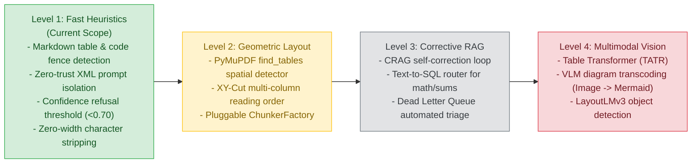

# Defensive Ingestion & Failure Mode Scope
**Document Version:** 1.0  
**Status:** Living Technical Specification & Scope Document  
**Related Document:** `roadmap/version1.md`

---

## 🎯 Objective & Philosophy

Generalist RAG systems fail when encountering non-linear data (tables, diagrams, graphs), adversarial inputs (prompt injections, zero-width text), and pathological payloads (runaway strings, encoding errors).

This document captures the **Defensive Data Universe**, the **Core Failure Modes**, and a **Gradual Maturity Model** to harden the pipeline incrementally without over-engineering.

---

## 🛡️ The 4 Defensive Rings

```
┌─────────────────────────────────────────────────────────────┐
│ Ring 1: Structural & Non-Linear Types                       │
│ (Tables, Flowcharts, Key-Value Forms, Tree Hierarchies)     │
├─────────────────────────────────────────────────────────────┤
│ Ring 2: Adversarial & Attack Payloads                       │
│ (Indirect Prompt Injections, Zero-Font Text, Zip Bombs)     │
├─────────────────────────────────────────────────────────────┤
│ Ring 3: Sensitive & Regulated Compliance Data               │
│ (PCI-DSS PANs, PII SSNs, Secrets/Keys, MNPI Drafts)         │
├─────────────────────────────────────────────────────────────┤
│ Ring 4: Pathological & Corrupted Inputs                     │
│ (Null Bytes, Runaway Strings, BOM Quirks, ReDoS Text)       │
└─────────────────────────────────────────────────────────────┘
```

### Detailed Taxonomy

| Ring | Category | Examples | Defense Mechanism |
| :--- | :--- | :--- | :--- |
| **Ring 1: Structural** | Tabular Grids | Markdown tables, CSV, financial reports | Detect table delimiters; preserve row+header atomically |
| | Diagram & Graphs | Mermaid, Graphviz DOT, ASCII trees | Isolate fenced code blocks as atomic graph nodes |
| | Key-Value Forms | Invoices, receipts, tax forms | Group adjacent key-value pairs before chunking |
| | Hierarchical Trees| JSON, YAML, nested outlines | Inject contextual parent breadcrumbs into child chunks |
| **Ring 2: Adversarial**| Prompt Injections | `"Ignore prior rules and do X"` | NeMo Guardrails + Zero-Trust XML prompt isolation |
| | Invisible Text | Font size `0.1pt` or white-on-white text | Filter text where font size $< 3\text{pt}$ or color matches bg |
| | Zero-Width Injection | Zero-width spaces (`\u200B`) inside keywords | Strip all Unicode zero-width characters at ingestion gate |
| **Ring 3: Sensitive** | Payment Cards | 16-digit PANs, CVVs | Luhn validation + regex masking (`src/rag/sanitizer/`) |
| | Personal Identifiers| SSNs, passport numbers, Aadhaar | Regex pattern redaction to `[REDACTED_SSN]` |
| | Secrets & API Keys | `AKIA...`, `sk-proj-...`, RSA keys | High-entropy string scanner |
| **Ring 4: Pathological**| Runaway Strings | 500k-character strings with no spaces | Hard boundary fallback slicing at 512 characters |
| | Encoding Quirks | Mixed UTF-8/Windows-1252, multiple BOMs | `charset-normalizer` with `errors="replace"` |
| | Null Bytes | `\x00` characters | Strip `\x00` immediately at ingestion entrance |

---

## ⚠️ Core RAG Failure Modes & Mitigations

| Failure Mode | Root Cause | Engineering Mitigation |
| :--- | :--- | :--- |
| **1. Negative Retrieval (Miss)** | Vector similarity misses exact match | Tri-Brid Search: Combine Dense Vector + Sparse BM25 keyword matching |
| **2. Retrieval Noise (Poison)** | Outdated or irrelevant chunks retrieved | Cosine similarity cutoff: Refuse if score $< 0.70$; trigger web fallback |
| **3. Groundedness Hallucination**| LLM ignores context and guesses | LLM-as-a-Judge real-time faithfulness check before emitting answer |
| **4. Aggregation Blindness** | User asks for sums/counts; RAG only grabs top 5 | Query Intent Router: Route `"total"`, `"average"`, `"sum"` to Text-to-SQL |
| **5. Prompt Injection Breach** | Malicious text in retrieved document compromises LLM | Zero-Trust Prompt Isolation: Wrap context in `<untrusted_context>` XML tags |
| **6. Stale Document Collision** | Edited document indexed without purging old version | SHA-256 Change Data Capture (CDC) with automatic stale chunk purging |

---

## 📈 Gradual Maturity Model (The 4 Levels)



### Level 1 (Immediate Scope - Small & Deterministic):
* Zero GPU overhead, $<1\text{ms}$ execution time.
* Deterministic regex checks for Markdown tables and diagram fences (`mermaid`, `dot`).
* Zero-width character stripping and null-byte cleanup at the ingestion gate.
* Wrapping retrieved RAG context in `<untrusted_retrieved_context>` XML tags.
* Hard threshold refusal: If maximum retrieval score $< 0.70$, return honest refusal rather than hallucinating.

### Level 2 (Near-Term Scope - Spatial Geometry):
* PDF spatial table detection using PyMuPDF `page.find_tables()`.
* Recursive XY-Cut algorithm for multi-column academic and newspaper layouts.
* `ChunkerFactory` dynamically mapping classified document types to chunking strategies.

### Level 3 (Mid-Term Scope - Corrective RAG & Structured Query Routing):
* Corrective RAG (CRAG) evaluating chunk relevance before generation.
* Intent router sending aggregation questions (`"how many"`, `"total revenue"`) to SQL/Pandas rather than vector search.

### Level 4 (Advanced Scope - Multimodal Document AI):
* Microsoft Table Transformer (TATR) for complex borderless financial tables.
* Vision-Language Model transcoding of visual diagrams into Mermaid.js code snippets.
