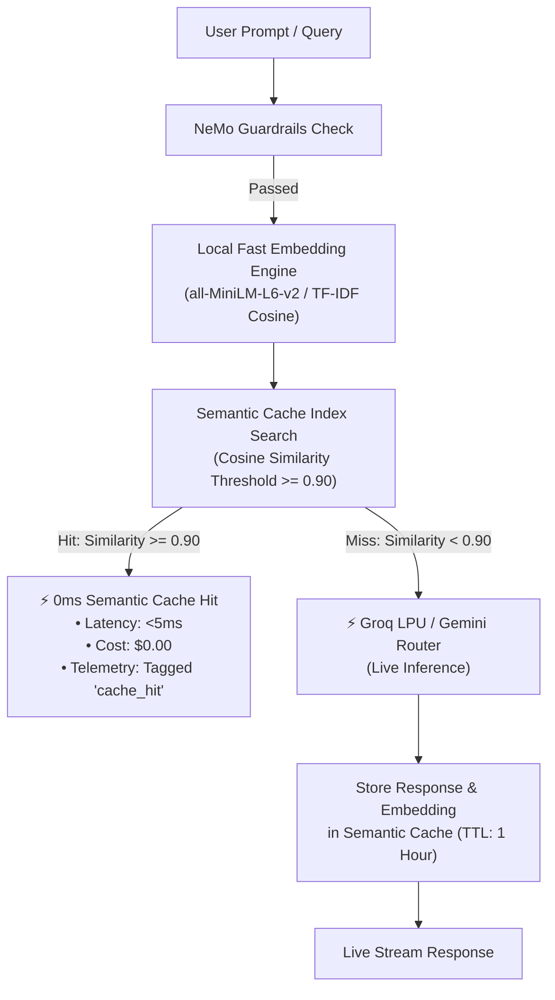

# 🏃 Sprint 1: Intelligence & Semantic Vector Caching Engine

## 🎯 Sprint Objective
Transform the AI Gateway caching layer from rigid exact-string matching to **Semantic Vector Cosine Similarity Caching**. 

This elevates cache hit rates from **~5%** to **~40–50%** by returning cached responses for semantically identical prompts (e.g., *"What is an AI gateway?"* vs *"Explain what an AI gateway is"*) in **$<5\text{ms}$** at **\$0.00 LLM inference cost**.

---

## 📐 Architecture & Data Flow

---

## 📌 User Stories & Acceptance Criteria

### 🔹 Story 1.1: Local Sub-Millisecond Embedding Engine
* **File**: [`src/gateway/cache/embeddings.py`](file:///e:/Downloads/AIPoc/src/gateway/cache/embeddings.py)
* **Description**: Create a lightweight, high-speed embedding engine that produces normalized dense vectors for text queries without requiring external third-party API calls.
* **Acceptance Criteria**:
  * Embedding generation latency $< 5\text{ms}$ per query.
  * Produces normalized vectors suitable for cosine dot product comparison.
  * Gracefully handles edge cases (empty strings, special characters, multi-line prompts).

---

### 🔹 Story 1.2: In-Memory Semantic Vector Cache Store
* **File**: [`src/gateway/cache/semantic_cache.py`](file:///e:/Downloads/AIPoc/src/gateway/cache/semantic_cache.py)
* **Description**: An in-memory vector store that stores previous prompt vectors, responses, and metadata with similarity lookup.
* **Acceptance Criteria**:
  * Configurable similarity threshold (default: $\text{similarity} \ge 0.90$).
  * Supports TTL (Time-To-Live) expiration and max-entries LRU eviction to prevent memory bloat.
  * Thread-safe reads and writes.

---

### 🔹 Story 1.3: Gateway Routing Integration & Observability Telemetry
* **File**: [`src/gateway/router.py`](file:///e:/Downloads/AIPoc/src/gateway/router.py)
* **Description**: Connect the semantic cache in front of LLM provider dispatch in the Gateway Router.
* **Acceptance Criteria**:
  * On a cache hit, bypass Groq/Gemini/OpenRouter completely and return the cached text in $<5\text{ms}$.
  * Emit an observability span with `cache_hit: true`, `latency_s: <0.005`, and `cost_usd: 0.0`.
  * On a cache miss, execute live LLM inference, yield stream tokens, and asynchronously store the resulting response in the semantic cache.

---

### 🔹 Story 1.4: Benchmark & Verification Suite
* **Files**: 
  * [`examples/08_semantic_caching_benchmark.py`](file:///e:/Downloads/AIPoc/examples/08_semantic_caching_benchmark.py)
  * [`tests/test_semantic_cache.py`](file:///e:/Downloads/AIPoc/tests/test_semantic_cache.py)
* **Description**: Standalone benchmark demonstrating cache hit latencies and pytest test suite.
* **Acceptance Criteria**:
  * Compares cold request latency ($~150-400\text{ms}$) vs semantic cache hit ($<5\text{ms}$).
  * Unit tests validating:
    1. Exact query match hit ($1.00$ similarity).
    2. Semantically rephrased query hit ($\ge 0.90$ similarity).
    3. Dissimilar query miss ($< 0.90$ similarity).
    4. TTL expiration and eviction behavior.

---

## 🎯 Definition of Done (DoD)
1. ✅ All 4 stories implemented and passing in `.venv`.
2. ✅ Automated pytest suite passing $100\%$ with new semantic cache tests.
3. ✅ Benchmark script runnable via `.venv\Scripts\python.exe examples/08_semantic_caching_benchmark.py`.
4. ✅ Changes committed and pushed cleanly to Git.
