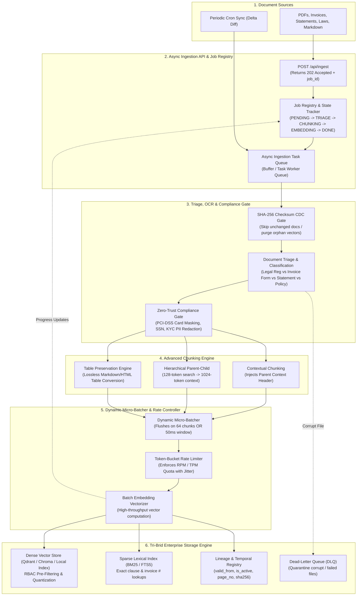

# 🏃 Sprint 2: Enterprise-Scale Document Ingestion, Background Workers & Tri-Brid RAG

## 🎯 Sprint Objective
Build a production-grade, enterprise-ready **Document Ingestion & Indexing Engine** capable of handling heterogeneous documents (Banking Regulations, Laws, Invoices, Account Statements, and Technical Documentation) at scale. 

Features **Asynchronous Background Task Workers**, **Dynamic Micro-Batching**, **Zero-Trust PII/PCI-DSS Redaction**, **Contextual & Hierarchical Chunking**, **Change Data Capture (CDC)**, and **Tri-Brid Retrieval (Dense Vector + BM25 Lexical + Structured Metadata)**.

---

## 📐 Architecture & Pipeline Flow

---

## 📌 User Stories & Acceptance Criteria

### 🔹 Story 2.1: Asynchronous Ingestion API & Job State Registry
* **Files**: [`src/rag/ingestion/api.py`](file:///e:/Downloads/AIPoc/src/rag/ingestion/api.py), [`src/rag/ingestion/job_tracker.py`](file:///e:/Downloads/AIPoc/src/rag/ingestion/job_tracker.py)
* **Description**: Create non-blocking ingestion endpoints returning `202 Accepted` + `job_id` with real-time SSE progress streaming.
* **Acceptance Criteria**:
  * `POST /api/ingest` accepts multi-file uploads and returns immediately with a unique `job_id`.
  * `GET /api/ingest/status/{job_id}` returns exact lifecycle state (`QUEUED`, `PARSING`, `CHUNKING`, `EMBEDDING`, `COMPLETED`, `FAILED`).
  * `GET /api/ingest/events/{job_id}` streams live Server-Sent Events (SSE) showing page-by-page progress percentages.

---

### 🔹 Story 2.2: Document Triage, Layout Parsing & Zero-Trust PII Redactor
* **Files**: [`src/rag/ingestion/triage.py`](file:///e:/Downloads/AIPoc/src/rag/ingestion/triage.py), [`src/rag/ingestion/sanitizer.py`](file:///e:/Downloads/AIPoc/src/rag/ingestion/sanitizer.py)
* **Description**: Classify incoming documents and sanitize sensitive data before vector generation.
* **Acceptance Criteria**:
  * Classifies documents into `LEGAL_REGULATION`, `INVOICE_RECEIPT`, `BANK_STATEMENT`, or `GENERAL_DOC`.
  * Redacts PCI-DSS credit card numbers, SSNs, and KYC PII using surrogate tokens (`[MASKED_PAN_1234]`, `[MASKED_SSN]`).
  * Extracts tables into structured Markdown tables without flattening columns.

---

### 🔹 Story 2.3: Contextual & Hierarchical Chunking Engine
* **Files**: [`src/rag/chunking/hierarchical.py`](file:///e:/Downloads/AIPoc/src/rag/chunking/hierarchical.py), [`src/rag/chunking/contextual.py`](file:///e:/Downloads/AIPoc/src/rag/chunking/contextual.py)
* **Description**: Implement Anthropic-style Contextual Chunking and Hierarchical Parent-Child indexing.
* **Acceptance Criteria**:
  * Generates $128\text{-token}$ child search chunks linked to $1,024\text{-token}$ parent context blocks.
  * Injects document-level parent context headers into child chunks prior to embedding.
  * Legal chunker respects section, article, and clause hierarchy.

---

### 🔹 Story 2.4: Dynamic Micro-Batcher, Rate Limiter & Background Worker
* **Files**: [`src/rag/pipeline/batcher.py`](file:///e:/Downloads/AIPoc/src/rag/pipeline/batcher.py), [`src/rag/pipeline/worker.py`](file:///e:/Downloads/AIPoc/src/rag/pipeline/worker.py)
* **Description**: High-throughput async worker pool that micro-batches chunks and manages API rate limits.
* **Acceptance Criteria**:
  * Micro-batches chunks (flushes when batch size reaches 64 chunks OR wait timeout exceeds $50\text{ms}$).
  * Token-bucket rate limiter enforces RPM/TPM quotas with exponential backoff and jitter on HTTP 429.
  * Yields a $>50\times$ speedup over sequential 1-by-1 embedding generation.

---

### 🔹 Story 2.5: Tri-Brid Indexing (Dense Vector + BM25 Lexical + Temporal Metadata)
* **Files**: [`src/rag/storage/hybrid_store.py`](file:///e:/Downloads/AIPoc/src/rag/storage/hybrid_store.py), [`src/rag/storage/cdc_registry.py`](file:///e:/Downloads/AIPoc/src/rag/storage/cdc_registry.py)
* **Description**: Dual-index store combining dense vector search and sparse BM25 lexical search with Reciprocal Rank Fusion (RRF).
* **Acceptance Criteria**:
  * Dense vector store indexes embeddings with RBAC metadata and department pre-filtering.
  * BM25 sparse index provides exact matches for regulation clause numbers and invoice IDs.
  * Stores temporal validity metadata (`valid_from`, `valid_to`, `is_active`) to prevent quoting superseded laws.
  * SHA-256 CDC registry skips duplicate unchanged documents (0ms duplicate processing).

---

### 🔹 Story 2.6: Dead-Letter Queue (DLQ) & Lineage Audit Store
* **Files**: [`src/rag/pipeline/dlq.py`](file:///e:/Downloads/AIPoc/src/rag/pipeline/dlq.py), [`src/rag/storage/audit.py`](file:///e:/Downloads/AIPoc/src/rag/storage/audit.py)
* **Description**: Fault tolerance quarantine for corrupt documents and cryptographic provenance tracking.
* **Acceptance Criteria**:
  * Corrupted files or parsing exceptions are routed to the DLQ with error diagnostics without crashing the worker fleet.
  * Audit store records immutable provenance: `source_file`, `sha256`, `page_number`, `ingested_at`, `redacted_fields`.

---

### 🔹 Story 2.7: Standalone Ingestion Benchmark & Verification Suite
* **Files**: 
  * [`examples/09_enterprise_ingestion_demo.py`](file:///e:/Downloads/AIPoc/examples/09_enterprise_ingestion_demo.py)
  * [`tests/test_ingestion_pipeline.py`](file:///e:/Downloads/AIPoc/tests/test_ingestion_pipeline.py)
* **Description**: End-to-end benchmark demonstrating background ingestion of multi-type documents, live progress streaming, and hybrid RRF search.
* **Acceptance Criteria**:
  * Validates CDC duplicate skipping ($0\text{ms}$ on second run).
  * Validates PII masking on financial statements.
  * Compares pure vector search vs Tri-Brid BM25 + Vector RRF search accuracy.
  * 100% passing unit and integration tests.

---

## 🎯 Definition of Done (DoD)
1. ✅ All 7 stories implemented with zero external SaaS dependencies.
2. ✅ Ingestion worker handles asynchronous batching with live progress reporting.
3. ✅ Tri-Brid retrieval returns exact clause numbers and conceptual legal precedents.
4. ✅ Pytest automated test suite passing $100\%$.
5. ✅ Committed and pushed cleanly to Git.
