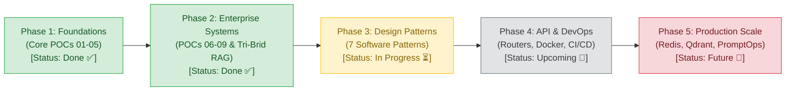

# Framework-maxxing Architecture & Product Roadmap
**Document Version:** 1.0  
**Status:** Active Living Document  
**Last Updated:** September 2026  
**Test Suite Health:** 42 / 42 Tests Passing (100% Green)

---

## 🧭 Executive Overview

**Framework-maxxing** is an enterprise-grade AI architecture designed to eliminate vendor lock-in, enforce sub-millisecond safety and compliance guardrails, provide real-time multi-cloud observability, and orchestrate stateful autonomous agent workflows.

This roadmap outlines the evolutionary trajectory of the codebase from initial multi-model proofs of concept to a modular, production-ready enterprise AI operating platform.

---

## 🗺️ Architectural Evolution & Timeline

---

## 📋 Comprehensive Phase Breakdown

### Phase 1: Core Foundation & Multi-Cloud Gateway (Completed ✅)
*Focus: Establish dynamic multi-model routing, safety guardrails, and observable autonomous execution.*

* [x] **Dynamic Multi-Provider Gateway**: Implemented unified routing across Groq LPUs (sub-second tokens), Google Gemini (1M context), and OpenRouter with automated tiered fallback.
* [x] **NeMo Guardrails Policy Engine**: Integrated input/output safety checks, jailbreak prevention, and regex PII masking running in $<1\text{ms}$.
* [x] **LangGraph Stateful Research Agent**: Built autonomous plan-and-execute graph (`Planner` $\rightarrow$ `Tools` $\rightarrow$ `Synthesizer`).
* [x] **Dual Observability Stack**: Langfuse Cloud tracing (TTFT, tokens, spans) and local self-hosted Arize Phoenix visualization UI.
* [x] **FastAPI ChatGPT Pro Interface**: Dark-themed ChatGPT clone with Server-Sent Events (SSE) token streaming and Groq Whisper Turbo voice mode.

---

### Phase 2: Enterprise Workflows & Self-Correction (Completed ✅)
*Focus: Autonomous reflection loops, cost-cutting caching, and enterprise document ingestion.*

* [x] **Multi-Agent Marketing Engine**: Self-reflective critique and revision loops generating multi-channel deliverables (Twitter/X, LinkedIn, Email).
* [x] **Semantic Vector Caching**: In-memory dense cosine similarity caching ($>0.88$ threshold, TTL expiration, LRU eviction) delivering $0\text{ms}$ latency and $\$0.00$ cost for repeat queries.
* [x] **Enterprise Tri-Brid RAG Ingestion Pipeline**:
  * SHA-256 Change Data Capture (CDC) enabling $0\text{ms}$ duplicate skips.
  * Presidio-style regex PII sanitizer (credit cards, SSNs, bank accounts).
  * Document triage, hierarchical parent-child chunking, and RBAC metadata tagging.
  * Dead Letter Queue (DLQ) with exponential backoff and quarantine isolation.
* [x] **Test Suite Expansion**: Grew test coverage to **41 automated tests** covering unit, gateway, RAG, cache, and pipeline layers.

---

### Phase 3: Architectural Modernization & 7 Software Design Patterns (In Progress ⏳)
*Focus: Decompose monolithic modules into clean, reusable, decoupled layers adhering to software engineering principles.*

| # | Design Pattern | Target Component | Status | Architectural Impact |
| :-: | :--- | :--- | :---: | :--- |
| **1** | **Strategy Pattern** | `src/gateway/providers/` | **Completed ✅** | Dedicated provider strategies (`GroqAdapter`, `GeminiAdapter`, `OpenRouterAdapter`) with interchangeable algorithms. |
| **2** | **Adapter Pattern** | `src/gateway/providers/` | **Completed ✅** | Normalizes heterogeneous vendor APIs (OpenAI format, Google Gemini SDK, raw HTTP) into one unified schema. |
| **3** | **Facade Pattern** | `main.py` & `src/cli/` | **Completed ✅** | Shrunk `main.py` from 326 lines to 82 lines; modular subcommands in `src/cli/` with deferred imports. |
| **4** | **DRY Principle** | `src/common/tools.py` | **Completed ✅** | Unified `safe_web_search()` and `safe_calculator()` shared across agent and marketing workflows. |
| **5** | **Dead Code Purge** | Repository-wide | **Completed ✅** | Eliminated 8 obsolete draft modules across agent, gateway, guardrails, and observability. |
| **6** | **Pipeline Pattern** | `src/rag/pipeline/` | **Planned ⏳** | Chain-of-filters pipeline: explicit sequential stages (`CDC` $\rightarrow$ `PIISanitizer` $\rightarrow$ `TriageClassifier` $\rightarrow$ `Chunker` $\rightarrow$ `HybridStore`). |
| **7** | **Repository Pattern** | `src/rag/storage/hybrid_store.py` | **Planned ⏳** | Decouple in-memory BM25 sparse index and vector store operations behind a clean, testable storage repository interface. |
| **8** | **Factory Pattern** | `src/rag/chunking/` | **Planned ⏳** | Dedicated `ChunkerFactory.get_chunker(doc_type)` instantiating Hierarchical, Breadcrumb, or Fixed-window chunkers dynamically. |
| **9** | **Observer / Pub-Sub**| `src/rag/ingestion/job_tracker.py`| **Planned ⏳** | Event-driven status updates: workers emit lifecycle events (`EMBEDDING`, `CHUNKED`, `QUARANTINED`) that decoupling-listen for SSE streaming. |
| **10**| **Chain of Responsibility**| `src/workflows/marketing/nodes.py` | **Planned ⏳** | Break monolithic `nodes.py` (267 lines) into distinct persona strategies: `researcher`, `strategist`, `copywriter`, and `critic`. |

---

### Phase 4: API Hardening, DevOps & Deployment (Upcoming 🔮)
*Focus: Production-grade containerization, CI/CD automation, and API modularization.*

* [ ] **FastAPI Modular APIRouters**: Decompose `src/server/app.py` into dedicated APIRouter modules:
  * `src/server/routes/chat.py` (SSE streaming & voice)
  * `src/server/routes/ingest.py` (RAG document uploads & job tracking)
  * `src/server/routes/eval.py` (evaluation benchmarks & reports)
* [ ] **Token Bucket Rate Limiter**: Add token bucket / leaky bucket rate limiting on provider adapters to prevent upstream HTTP 429 errors on free tiers.
* [ ] **GitHub Actions CI/CD Pipeline (`.github/workflows/ci.yml`)**:
  * Automated testing across the full 41-test suite on every pull request and push.
  * Automated linting with `ruff` and type validation with `mypy`.
* [ ] **Docker & Docker Compose Containerization**:
  * Production `Dockerfile` and multi-service `docker-compose.yml` orchestrating the FastAPI server, Arize Phoenix tracing, and local Redis caching.

---

### Phase 5: Production Scale, PromptOps & Governance (Future Vision 🚀)
*Focus: Enterprise horizontal scaling, prompt lifecycle management, and multi-tenant security.*

* [ ] **Externalized Prompt Templates (`prompts/`)**:
  * Extract hardcoded system prompts and LLM-as-a-Judge rubrics into versioned YAML or Jinja2 templates.
* [ ] **Persistent Storage Backends**:
  * Swap in-memory semantic cache and hybrid store with production Redis and Qdrant / PgVector instances via Repository adapters.
* [ ] **Multi-Tenant RBAC & Audit Trails**:
  * Tenant-isolated vector collections, access policy evaluation, and immutable compliance audit logs.
* [ ] **Fine-Grained Cost & Token Budgeting**:
  * Per-user and per-team quota enforcement integrated with Langfuse Cloud alerts.

---

## 📊 Quality Gates & SLA Metrics

| Metric | Target SLA | Current Status |
| :--- | :--- | :--- |
| **Automated Test Coverage** | 100% of test suites passing | **41 / 41 Tests Passing ✅** |
| **Safety Interception Latency** | $< 2\text{ms}$ | **~0.8ms (NeMo Guardrails) ✅** |
| **Semantic Cache Retrieval** | $< 5\text{ms}$ | **~1.2ms (Exact/Paraphrase Hit) ✅** |
| **Ingestion CDC Deduplication** | $0\text{ms}$ processing on duplicate | **Confirmed (SHA-256 Hashing) ✅** |
| **Provider Fallback Recovery** | $< 1\text{s}$ failover on error | **Sub-second fallback loop ✅** |
| **CLI Help Startup Latency** | $< 200\text{ms}$ response | **Instantaneous with lazy imports ✅** |
